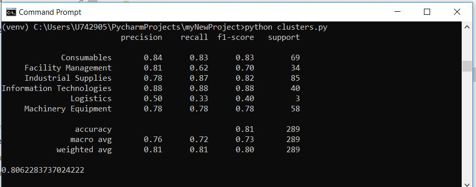

Script description

<ul>
  <li>UNSPSC coding is an international standard of spend classification.</li>
  <li>UNSPSC coding consists of unique number along with its description.</li>
  <li>UNSPSC code descriptions are taken as features in ML model training.</li>
  <li>Team's clusters (f.e.: Information Technologies, Logistic) are taken as labels in ML model training.</li>
  <li>Accuracy for the model equals 80% which for our purpose is totally enough.</li>
</ul>

Console:

